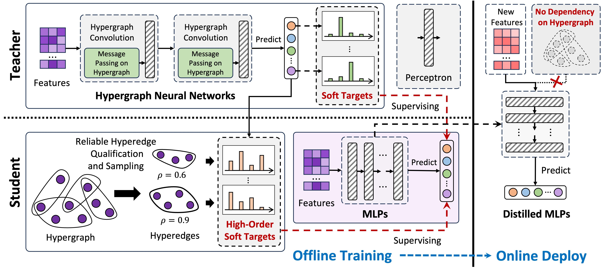

# LightHGNN
This repository contains the source code for the paper "LightHGNN: Distilling Hypergraph Neural Networks into MLPs for 100x Faster Inference" published in IEEE Transactions on Pattern Analysis and Machine Intelligence (TPAMI) 2024 by [Yifan Feng](https://fengyifan.site/), Yihe Luo, Shihui Ying, Yue Gao*. This paper is available at [here](https://openreview.net/forum?id=lHasEfGsXL).



## Introduction
In this repository, we provide the implementation of our LightHGNNs, including LightHGNN and LightHGNN+, which is based on the following environments:
* [python 3.9](https://www.python.org/): basic programming language.
* [dhg 0.9.4](https://github.com/iMoonLab/DeepHypergraph): for hypergraph representation and learning. 
* [torch 1.12.1](https://pytorch.org/): for computation.
* [hydra-core 1.3.2](https://hydra.cc/docs/intro/): for configuration and multi-run management.


## Installation 
1. Clone this repository.
2. Install the required libraries.
``` bash
pip install -r requirements.txt
```

## Usage
For transtive setting, you can run the following command:
```bash
python trans_train.py
```
For multi-run and obtain the average results, you can run the following command:
```bash
python trans_multi_exp.py
```
For production setting, you can run the following command:
```bash
python prod_train.py
```
For multi-run and obtain the average results, you can run the following command:
```bash
python prod_multi_exp.py
```

**Change Models**
You can change the teacher by modifying the `teacher` in `trans_config.yaml` and `prod_config.yaml` as following:
```yaml
model:
    teacher: hgnn # hgnn, hgnnp, hnhn, unigcn
```
Also, you can change the student by modifying the `student` in `trans_config.yaml` and `prod_config.yaml` as following:
```yaml
model:
    student: light_hgnn # light_hgnn, light_hgnnp
```

**Change Datasets**
In our paper, 13 grpah/hypergraph datasets are adopted for evaluation.
- Graph datasets: `cora`, `pubmed`, `citeseer`
- Hypergraph datasets: `news20`, `ca_cora`, `cc_cora`, `cc_citeseer`, `dblp4k_conf`, `dblp4k_paper`, `dblp4k_term`, `imdb_aw`, `recipe_100k`, `recipe_200k`

You can change the dataset by modifying the `dataset` in `trans_config.yaml` and `prod_config.yaml` as following:
```yaml
data:
    name: dblp4k_paper # cora, pubmed, news20, ca_cora, dblp4k_term, imdb_aw, ...
```

**Important Note**
Since the `recipe_100k` and `recipe_200k` datasets are too large and contains more than 10k vertices, the two dataset can only be used under the production setting. **Please do not use the two datasets for the transitive setting.**

## Citation
If you find this repository useful in your research, please cite the following papers:
```
@inproceedings{feng2024lighthgnn,
title={Light{HGNN}: Distilling Hypergraph Neural Networks into {MLP}s for 100x Faster Inference},
author={Feng, Yifan and Luo, Yihe and Ying, Shihui and Gao, Yue},
booktitle={The Twelfth International Conference on Learning Representations},
year={2024},
}

@article{gao2022hgnn+,
  title={HGNN+: General hypergraph neural networks},
  author={Gao, Yue and Feng, Yifan and Ji, Shuyi and Ji, Rongrong},
  journal={IEEE Transactions on Pattern Analysis and Machine Intelligence},
  volume={45},
  number={3},
  pages={3181--3199},
  year={2022},
  publisher={IEEE}
}

@inproceedings{feng2019hypergraph,
  title={Hypergraph neural networks},
  author={Feng, Yifan and You, Haoxuan and Zhang, Zizhao and Ji, Rongrong and Gao, Yue},
  booktitle={Proceedings of the AAAI conference on artificial intelligence},
  volume={33},
  number={01},
  pages={3558--3565},
  year={2019}
}
```


